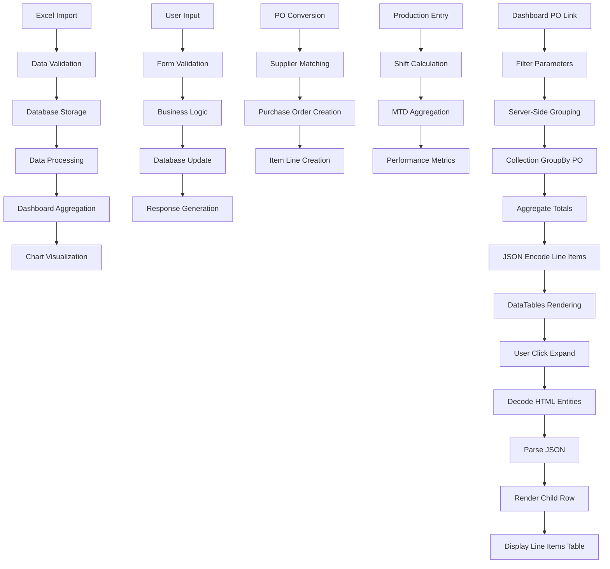
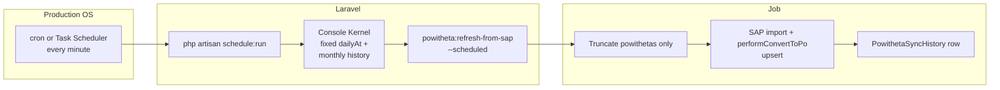

Purpose: Technical reference for understanding system design and development patterns
Last Updated: 2026-04-30

## Architecture Documentation Guidelines

### Document Purpose

This document describes the CURRENT WORKING STATE of the application architecture. It serves as:

-   Technical reference for understanding how the system currently works
-   Onboarding guide for new developers
-   Design pattern documentation for consistent development
-   Schema and data flow documentation reflecting actual implementation

### What TO Include

-   **Current Technology Stack**: Technologies actually in use
-   **Working Components**: Components that are implemented and functional
-   **Actual Database Schema**: Tables, fields, and relationships as they exist
-   **Implemented Data Flows**: How data actually moves through the system
-   **Working API Endpoints**: Routes that are active and functional
-   **Deployment Patterns**: How the system is actually deployed
-   **Security Measures**: Security implementations that are active

### What NOT to Include

-   **Issues or Bugs**: These belong in `MEMORY.md` with technical debt entries
-   **Limitations or Problems**: Document what IS working, not what isn't
-   **Future Plans**: Enhancement ideas belong in `backlog.md`
-   **Deprecated Features**: Remove outdated information rather than marking as deprecated
-   **Wishlist Items**: Planned features that aren't implemented yet

### Update Guidelines

-   **Reflect Reality**: Always document the actual current state, not intended state
-   **Schema Notes**: When database schema has unused fields, note them factually
-   **Cross-Reference**: Link to other docs when appropriate, but don't duplicate content

### For AI Coding Agents

-   **Investigate Before Updating**: Use codebase search to verify current implementation
-   **Move Issues to Memory**: If you discover problems, document them in `MEMORY.md`
-   **Factual Documentation**: Describe what exists, not what should exist

---

# System Architecture

## Project Overview

**ARK-GS (ARK Global System)** is a comprehensive enterprise resource planning (ERP) system designed for industrial operations management, specifically focused on procurement, production tracking, and financial management. The system handles multiple business domains including:

-   **Purchase Order Management**: POWITHETA data processing and PO conversion
-   **Goods Receipt Processing**: GRPO (Goods Receipt Purchase Order) management
-   **Production Monitoring**: Daily production tracking with shift-based operations
-   **Budget Management**: CAPEX and regular budget tracking
-   **Supplier Management**: Vendor and supplier relationship management
-   **Project Management**: Multi-project support with project-specific tracking
-   **Financial Reporting**: Comprehensive dashboards and analytics

## Technology Stack

-   **Backend**: Laravel 8.75+ (PHP 7.3+)
-   **Frontend**: Blade templates with AdminLTE 3.x UI framework
-   **Database**: MySQL with Eloquent ORM
-   **Authentication**: Laravel Sanctum with Spatie Permission package
-   **Data Processing**: Laravel Excel (Maatwebsite) for import/export operations
-   **UI Components**: DataTables (Yajra) for dynamic tables
-   **Data Visualization**: 
    -   Chart.js (local asset: public/adminlte/plugins/chart.js/) for basic visualizations
    -   ApexCharts v3.45.1 (local asset: public/adminlte/plugins/apexcharts/) for interactive charts
-   **PDF Generation**: DomPDF for report generation
-   **Asset Compilation**: Laravel Mix with Webpack

## Core Components

### 1. Data Import/Export System

-   **POWITHETA Controller**: Handles purchase order data from SAP systems
-   **PO Controller**: Manages purchase order views and detailed drill-down pages
    -   **PO Sent Details Page** (`/dashboard/po-sent-details`):
        -   Grouped display by PO Number with aggregated totals
        -   Expandable rows showing individual line items
        -   DataTables with server-side processing
        -   Supports filtering by project, year, month, budget type
        -   199 line items condensed to 59 PO Numbers for better overview
-   **GRPO Controller**: Manages goods receipt processing
-   **MIGI Controller**: Processes material issue data
-   **INCOMING Controller**: Handles incoming material tracking
-   **Daily Production Controller**: Manages production data entry and tracking

### 2. Dashboard System

-   **Daily Dashboard**: Real-time operational metrics
-   **Monthly Dashboard**: Monthly performance analytics
-   **Yearly Dashboard**: Annual reporting and trends with comprehensive index page
    -   **Index Page** (`resources/views/dashboard/yearly/index.blade.php`):
        -   Year selection card with modern dropdown interface
        -   Information card explaining dashboard features
        -   Quick links navigation to Daily, Monthly, Summary by Unit, Search PO
        -   Current year preview cards (full-width, stacked vertically):
            -   REGULER card: Budget vs PO Sent with progress bars and status badges
            -   GRPO card: Completion rates with color-coded performance indicators
            -   NPI Index card: Production efficiency with lower-is-better logic
            -   CAPEX card: Capital expenditure tracking
        -   Multi-year performance chart showing 5-year trends (Budget, PO Sent, GRPO)
    -   **Display Page** (`resources/views/dashboard/yearly/new_display.blade.php`):
        -   Interactive ApexCharts visualizations (7 chart types)
        -   Budget Performance Bar Chart (Budget vs PO Sent comparison)
        -   Budget Distribution Donut Chart (project allocation breakdown)
        -   GRPO Completion Rate Bar Chart (color-coded performance indicators)
        -   GRPO Gauge Chart (overall completion percentage)
        -   NPI Production Index Bar Chart (incoming/outgoing comparison)
        -   NPI Scatter Chart (production flow analysis)
        -   Radar Chart (360° multi-metric performance view)
        -   Individual chart export to PNG/SVG
        -   Interactive tooltips, zoom, and pan capabilities
        -   Responsive design for mobile and desktop
-   **Other Dashboards**: Specialized views for different business units

### 3. User Management

-   **Role-based Access Control**: Using Spatie Permission package
-   **Multi-project Support**: Users can be assigned to specific projects
-   **Authentication**: Laravel Sanctum for API and web authentication

### 4. Budget Management

-   **Budget Types**: Configurable budget categories
-   **Budget Tracking**: CAPEX vs Regular budget monitoring
-   **History Management**: Manual and batch-captured **monthly** snapshots in **`histories`** (`periode`, `gs_type`, `project_code`, `amount`, `remarks` including `BATCH yyyymmdd`). **UI**: History page modal posts to `HistoryController::generate_monthly`. **CLI**: `php artisan history:generate-monthly` (optional `Y-m-d` capture date; default today) delegates to **`App\Services\MonthlyHistoryCaptureService`**, which reads the same aggregates as **`DashboardDailyController::getDailyData()`** and creates rows for capex, `po_sent`, `grpo_amount`, `incoming_qty`, and `outgoing_qty`. Scheduled: **1st of each month at 10:05** via `app/Console/Kernel.php` (`withoutOverlapping(60)`).
-   **Monthly vs daily REGULER/CAPEX budget**: The **daily** dashboard (`CapexController::reguler_daily` / `capex_daily`) sums **`budgets.amount`** per project and month (`budget_type_id` 2 for REG, 8 for CAPEX). The **monthly** dashboard (`MonthlyHistoryController::reguler_history_monthly` / `capex_history_monthly`) uses the same tables and **`sum('amount')`** per project/month so totals match daily when the selected month equals the calendar month used on the daily screen. (Earlier `first()` on budget could undercount when multiple budget lines existed.)

## Database Schema

### Core Business Tables

#### Purchase & Procurement

-   **powithetas**: Purchase order data from SAP (PO_NO, vendor info, items, amounts)
-   **powitheta_sync_histories**: Audit log for manual and scheduled SAP refresh runs (trigger, status, SAP date range, imported count, errors)
-   **grpos**: Goods receipt processing orders (GRPO_NO, delivery tracking)
-   **migis**: Material issue transactions
-   **incomings**: Incoming material tracking
-   **purchase_orders**: Normalized PO structure with supplier relationships
-   **purchase_order_items**: Individual line items for POs
-   **suppliers**: Vendor/supplier master data

#### Production Management

-   **daily_productions**: Daily production metrics (shifts, MTD data, limestone/shalestone)
-   **production_plans**: Production planning and forecasting
-   **projects**: Project master data with active/inactive status

#### Financial Management

-   **budgets**: Budget allocation and tracking
-   **budget_types**: Budget category definitions
-   **histories**: Financial transaction history

#### System Tables

-   **users**: User accounts with project assignments
-   **roles/permissions**: Spatie permission system tables
-   **progress_trackers**: System operation tracking
-   **po_exclusions**: PO numbers excluded from dashboard/report filters (po_no, reason)

### Key Relationships

-   Users → Projects (via project_code)
-   Purchase Orders → Suppliers → Purchase Order Items
-   Daily Productions → Users (created_by)
-   Budgets → Budget Types

## API Design

### Web Routes (MVC Pattern)

All routes follow RESTful conventions with resource controllers:

```
/auth → Authentication (login, register, logout)
/dashboard/* → Dashboard views (daily, monthly, yearly, other)
/powitheta/* → PO data management (index, import, export, convert)
/grpo/* → Goods receipt management
/migi/* → Material issue tracking
/incoming/* → Incoming material management
/daily-production/* → Production data CRUD operations
/budget/* → Budget management
/users/* → User management with role assignments
/roles/* → Role management
/permissions/* → Permission management
/po-exclusions/* → PO exclusion list (admin only; excludes POs from filters)
/admin/powitheta-schedule → Superadmin: enable sync, SAP date mode, staging modules flag, sync history (note: POWITHETA run times are fixed in Console `Kernel`; form defaults for times remain for reference / future use)
/api/powitheta-sync-status → JSON: scheduled sync in progress (public; used by ticker)
```

### Data Processing Flow

1. **Import**: Excel files → Validation → Database storage
2. **Export**: Database queries → Excel/PDF generation → Download
3. **Conversion**: POWITHETA data → Purchase Orders → Supplier relationships
4. **Scheduled jobs** (automated): OS invokes **`php artisan schedule:run` every minute** (same timezone rules as below). Laravel **`app/Console/Kernel.php`** registers:
    - **`history:generate-monthly`**: cron **`5 10 1 * *`** — first day of each month at **10:05** (`withoutOverlapping(60)`).
    - **`powitheta:refresh-from-sap --scheduled`**: daily at **06:05** and **12:05** (`withoutOverlapping(20)`), only if **`powitheta_schedule.json`** has **`enabled`** true.
    - **`staging-modules:sync-from-sap --scheduled`**: daily at **06:10** and **12:10** (five minutes after each POWITHETA slot; `withoutOverlapping(25)`), only if **`enabled`** and **`staging_modules_enabled`** are true.

    POWITHETA wall-clock times are **fixed in `Kernel`** (not driven by **`sync_times`** in JSON). JSON still controls **`enabled`**, **`staging_modules_enabled`**, **`sap_date_mode`**, custom SAP ranges (`PowithetaScheduleSettings::getScheduledSapDatePayload()`), and the superadmin UI defaults for **`sync_times`** (`06:05` / `12:05` defaults in code for display consistency).

    POWITHETA path: staging-only truncate of `powithetas`, then same `sync_from_sap` + upsert `performConvertToPo()` as the UI. Staging-modules path: GRPO/MIGI/Incoming SAP sync with dedupe. In-progress POWITHETA state: cache + **`GET /api/powitheta-sync-status`** ticker.
5. **Dashboard**: Real-time aggregation → Chart.js/ApexCharts visualizations
6. **Yearly Dashboard**: Data aggregation → JSON encoding → ApexCharts rendering → Interactive charts
7. **PO Details Drill-Down**:
   - Dashboard link click → Filter parameters (project, year, month, budget_type)
   - Server-side data grouping using Laravel collections (groupBy, map)
   - Aggregation of item counts and total amounts per PO
   - JSON encoding of nested line items array
   - DataTables rendering with child row capability
   - Client-side HTML entity decoding before JSON parsing
   - Expandable rows showing formatted line item tables with subtotals

### Yearly Dashboard Implementation Details

**Controllers:**

-   `DashboardYearlyController`: Main controller handling year selection and data routing
-   `YearlyIndexController`: Processes current year data (include_projects: 017C, 021C, 022C, 023C, 025C, APS)
-   `YearlyHistoryController`: Processes historical year data with same project inclusion

**Data Flow:**

1. User selects year → POST to `/dashboard/yearly`
2. Controller determines current vs historical year
3. Appropriate controller processes data (reguler, capex, grpo, npi metrics)
4. Data passed to view via compact array
5. Blade template JSON-encodes data for JavaScript
6. ApexCharts library initializes 7 interactive charts
7. Charts render with Indonesian number formatting and custom tooltips

**Chart Export:**

-   Individual chart export via ApexCharts dataURI() method
-   Supports PNG and SVG formats
-   Dashboard-wide export to Excel/PDF/CSV via backend routes

**Key Technical Notes:**

-   Scripts must load via @section('scripts') after jQuery
-   Chart initialization delayed 500ms for library loading
-   Select2 is optional with fallback handling
-   Data transformation uses {!! json_encode() !!} to prevent HTML entity encoding

## Data Flow


```mermaid
graph TD
    A[Excel Import] --> B[Data Validation]
    B --> C[Database Storage]
    C --> D[Data Processing]
    D --> E[Dashboard Aggregation]
    E --> F[Chart Visualization]

    G[User Input] --> H[Form Validation]
    H --> I[Business Logic]
    I --> J[Database Update]
    J --> K[Response Generation]

    L[PO Conversion] --> M[Supplier Matching]
    M --> N[Purchase Order Creation]
    N --> O[Item Line Creation]

    P[Production Entry] --> Q[Shift Calculation]
    Q --> R[MTD Aggregation]
    R --> S[Performance Metrics]

    T[Dashboard PO Link] --> U[Filter Parameters]
    U --> V[Server-Side Grouping]
    V --> W[Collection GroupBy PO]
    W --> X[Aggregate Totals]
    X --> Y[JSON Encode Line Items]
    Y --> Z[DataTables Rendering]
    Z --> AA[User Click Expand]
    AA --> AB[Decode HTML Entities]
    AB --> AC[Parse JSON]
    AC --> AD[Render Child Row]
    AD --> AE[Display Line Items Table]
```

### POWITHETA scheduled SAP sync (implemented)


```mermaid
flowchart LR
    subgraph os [Production OS]
        cron["cron or Task Scheduler\nevery minute"]
    end
    subgraph laravel [Laravel]
        sr["php artisan schedule:run"]
        k["Console Kernel\nfixed dailyAt +\nmonthly history"]
        cmd["powitheta:refresh-from-sap\n--scheduled"]
    end
    subgraph work [Job]
        t["Truncate powithetas only"]
        sap["SAP import + performConvertToPo\nupsert"]
        h["PowithetaSyncHistory row"]
    end
    cron --> sr --> k --> cmd
    cmd --> t --> sap --> h
```

**Operational rule**: Laravel does not run the scheduler by itself. The server must call `schedule:run` every minute (inexpensive when no job is due). After deploy, run **`php artisan schedule:list`** and confirm POWITHETA (06:05 / 12:05), staging-modules (06:10 / 12:10), and **`history:generate-monthly`** (day 1, 10:05). See [decisions.md](decisions.md) and [planned-powitheta-scheduled-sync.md](planned-powitheta-scheduled-sync.md).

## Security Implementation

### Authentication & Authorization

-   **Laravel Sanctum**: API token authentication
-   **Spatie Permission**: Role-based access control (RBAC)
-   **Middleware Protection**: Auth middleware on all protected routes
-   **CSRF Protection**: Laravel's built-in CSRF token validation
-   **Password Hashing**: Laravel's bcrypt hashing

### Data Protection

-   **Mass Assignment Protection**: Eloquent model $fillable/$guarded properties
-   **SQL Injection Prevention**: Eloquent ORM with parameterized queries
-   **XSS Protection**: Blade template escaping
-   **File Upload Security**: Excel import validation and sanitization

### Access Control

-   **Role-based Routes**: Different access levels for different user roles
-   **Project Isolation**: Users can only access their assigned project data
-   **Admin Functions**: Restricted administrative operations

## Deployment

### Development Environment

-   **Local Server**: Laravel Artisan serve (php artisan serve)
-   **Database**: MySQL with Laravel migrations
-   **Asset Compilation**: Laravel Mix (npm run dev/prod)
-   **Testing**: PHPUnit for backend testing

### Production Considerations

-   **Web Server**: Apache/Nginx with PHP-FPM
-   **Database**: MySQL with proper indexing for large datasets
-   **File Storage**: Local storage for Excel imports/exports
-   **Caching**: Laravel's file/database caching for dashboard data
-   **Logging**: Laravel's logging system for error tracking
-   **Laravel scheduler**: After `git pull` / deploy, ensure **`APP_TIMEZONE`** in `.env` matches business intent (e.g. `Asia/Makassar` for WITA). Configure **cron** (Linux) or **Windows Task Scheduler** to run `php artisan schedule:run` **every minute** from the application root, as the same user that owns the project files. Verify with `php artisan schedule:list` (expect POWITHETA, staging-modules, and monthly **`history`** entries). Without this, scheduled SAP sync and monthly history capture do not run automatically. **Windows Server + XAMPP**: [deploy-production-windows-xampp.md](deploy-production-windows-xampp.md).
